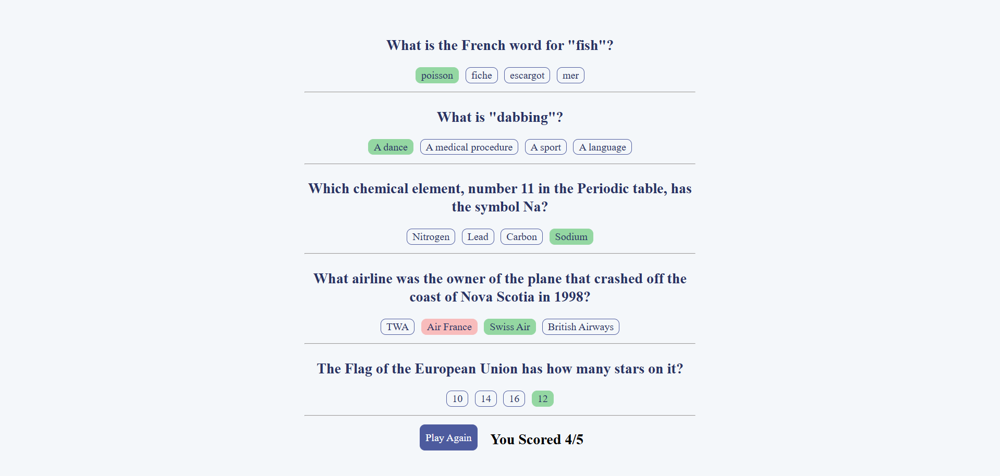

# **[Quizzify](https://quizzifyf.netlify.app/)**

## Overview
**Quizzify** is a modern quiz application designed for users to test their knowledge across various topics in a clean and engaging interface. Built with **React, Vite**, it offers a seamless user experience from login to quiz completion.

## Features
-  **User authentication** with login, signup, and password recovery.
-  **Topic selection** to choose your area of interest.
-  **Multiple-choice quiz interface** with a clean and intuitive design.
-  **Responsive UI** built with modern styling.

## Screenshots

### 🌐 Landing Page


### 🔐 Login & Signup


### 🔁 Forgot Password


### 📚 Select Topic


### 📝 Quiz Interface


## Technologies Used
- **React** – Component-based architecture
- **Vite** – Lightning-fast development and build tool
- **[Question Api](https://opentdb.com/api_config.php) API** (For feching the questions)

## Installation

### Prerequisites
Ensure you have **Node.js** and **npm** installed.

### Steps to Run
1. Clone the repository:
   ```bash
   git clone https://github.com/yourusername/Quizzify.git
   ```
2. Navigate to the project folder:
   ```bash
   cd Quizzify
   ```
3. Install dependencies:
   ```bash
   npm install
   ```
4. Start the development server:
   ```bash
   npm run dev
   ```
5. Open `http://localhost:5173/` in your browser.


## Deployment

### 🌐 Frontend Deployment
To deploy the **frontend** on platforms like **Vercel**, **Netlify**, or **GitHub Pages**:

1. Build the frontend:
   ```bash
   npm run build
   ```
2. Deploy the contents of the `/dist` folder using your preferred platform.

### 🖥️ Backend Deployment
To deploy the **backend** (e.g., a Node.js/Express API):

1. Ensure your backend is production-ready and includes a `.env` file with environment variables.
2. If using platforms like **Render**, **Railway**, or **Heroku**:
   - Push your backend code to a Git repository (e.g., GitHub).
   - Connect your repo to the platform.
   - Set the environment variables in the platform’s dashboard.
   - Specify the start command (e.g., `node index.js` or `npm start`).
3. Once deployed, update the frontend to point to the deployed backend URL (e.g., update `API_BASE_URL` in `.env` or config file).
4. Redeploy the frontend if necessary.

